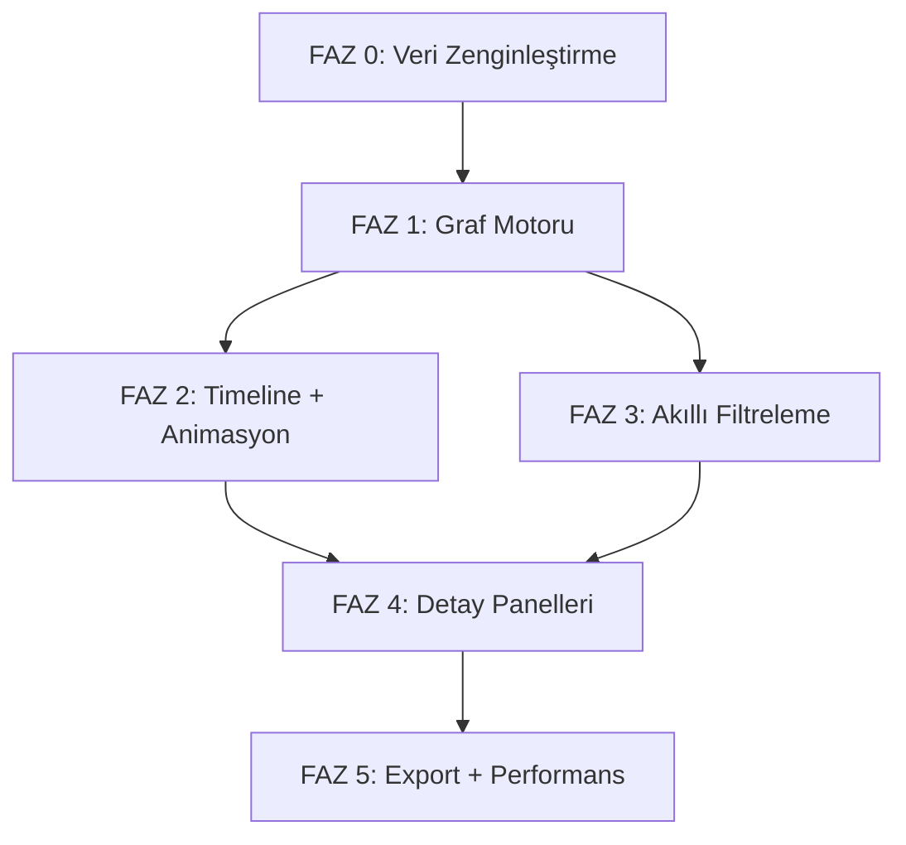

# ProcDot-Tarzı Görselleştirme (Visualization) Yol Haritası

## 🔎 Tersine Mühendislik Analizi — Mevcut Durum

### Mevcut Mimari
```
┌──────────────────────────────────────────────────┐
│  Linux Kernel (eBPF)                             │
│  └─ sysdig -j  (JSON çıktılı syscall yakalama)  │
└──────────────┬───────────────────────────────────┘
               │ child_process.spawn
┌──────────────▼───────────────────────────────────┐
│  backend.js (Node.js WebSocket Server :8091)     │
│  • readline → JSON parse → WS broadcast          │
│  • GET_PROCESS_TREE (ps -eo ... 11 sütun)        │
│  • GET_PROCESSES, GET_PORTS, GET_USERS            │
│  • CHECK_STATUS, INSTALL_DEPS                     │
│  • START / STOP capture yönetimi                  │
└──────────────┬───────────────────────────────────┘
               │ ws://
┌──────────────▼───────────────────────────────────┐
│  SvelteKit Frontend (frontend/)                  │
│  ├─ stores.js → eventsData, treeData, filters    │
│  ├─ websocket.js → connectWebSocket, commands     │
│  └─ components/                                   │
│     ├─ EventTable.svelte   (gerçek zamanlı tablo)│
│     ├─ ProcessTree.svelte  (PID/PPID ağaç görünümü) │
│     ├─ TreeNode.svelte     (recursive ağaç düğümü)│
│     ├─ Header / Sidebar / TabBar                  │
│     ├─ LookupModal / InstallModal                 │
│     └─ EventDetailModal                           │
└──────────────────────────────────────────────────┘
```

### Mevcut Veri Yapısı (Backend → Frontend)

**Syscall Event Payload:**
```json
{
  "evt_type": "open",
  "evt_dir": ">",
  "proc_name": "nginx",
  "proc_pid": 1234,
  "proc_ppid": 1,
  "user_name": "root",
  "fd_name": "/etc/passwd",
  "evt_args": "fd=3(file)",
  "res": "0"
}
```

**Process Tree Payload (ps -eo ...):**
```json
{
  "pid": "1234", "ppid": "1", "user": "root",
  "cpu": "0.5", "mem": "1.2", "stat": "S",
  "tty": "?", "start": "Apr14", "time": "0:01",
  "comm": "nginx", "cmdline": "nginx: master process /usr/sbin/nginx"
}
```

### Ne Eksik? (ProcDot ile Karşılaştırma)

| Özellik | ProcDot | Mevcut Dashboard | Durum |
|---------|---------|------------------|-------|
| Gerçek zamanlı event akışı | ✓ | ✓ | ✅ Var |
| Process Tree (tablo) | ✓ | ✓ | ✅ Var |
| **İnteraktif Graf Görselleştirme** | ✓ | ✗ | ❌ Yok |
| **Düğüm (Node): Süreç, Dosya, Ağ** | ✓ | ✗ | ❌ Yok |
| **Kenar (Edge): read, write, connect** | ✓ | ✗ | ❌ Yok |
| **Zaman Çizelgesi (Timeline)** | ✓ | ✗ | ❌ Yok |
| **Animasyon Modu** | ✓ | ✗ | ❌ Yok |
| **Akıllı Filtreleme (graf üzerinde)** | ✓ | △ (tablo bazlı) | ⚠ Kısmi |
| **PCAP / Ağ koreasyonu** | ✓ | ✗ | ❌ Yok |
| **Dışa Aktarma (SVG/PNG/DOT)** | ✓ | ✗ | ❌ Yok |
| Süreç detay paneli | ✓ | ✓ | ✅ Var |
| Thread injection tespiti | ✓ | ✗ | ❌ İleri seviye |

---

## 🗺️ Yol Haritası: 0'dan 100'e ProcDot-Tarzı Görselleştirme

### FAZ 0 — Altyapı ve Veri Zenginleştirme (Görev 0–15)

> Backend'in event verisini grafik oluşturmaya yetecek düzeyde zenginleştirmek.

| # | Görev | Açıklama | Dosya(lar) |
|---|-------|----------|------------|
| 0 | Planlama onayı | Bu yol haritasını gözden geçir ve onayla | `visualize.md` |
| 1 | Event verisini genişlet | `evt.rawtime`, `thread.tid`, `proc.exe`, `fd.typechar`, `fd.ip`, `fd.port` alanlarını sysdig JSON çıktısına ekle | `backend.js` |
| 2 | Event ID üretimi | Her event'e benzersiz artan `evt_id` ata (frontend'de referans için) | `backend.js` |
| 3 | Event buffer (ring buffer) | Son N (varsayılan 5000) event'i bellekte tut, summary endpoint'i sun | `backend.js` |
| 4 | Event istatistik toplayıcı (aggregator) | Süreç → dosya, süreç → ağ, süreç → süreç etkileşim sayaçları | `backend.js` → `lib/aggregator.js` [NEW] |
| 5 | Grafik veri modeli tanımı | `GraphNode` (process/file/network) ve `GraphEdge` (read/write/connect) TypeScript/JS arayüzleri | `frontend/src/lib/graph/types.js` [NEW] |
| 6 | Grafik veri dönüştürücü | Raw event[] → { nodes[], edges[] } dönüşüm fonksiyonu | `frontend/src/lib/graph/transformer.js` [NEW] |
| 7 | Grafik Svelte store'u | `graphNodes`, `graphEdges`, `graphConfig` writable store'ları | `frontend/src/lib/graph/stores.js` [NEW] |
| 8 | WebSocket veri akışına graf entegrasyonu | Gelen her event'i transformer'a besle, store'ları güncelle | `frontend/src/lib/websocket.js` |
| 9 | Ağ bilgisi ayrıştırıcı | `fd.name` → IP, port, protokol çıkarımı (IPv4/IPv6 parse) | `frontend/src/lib/graph/network-parser.js` [NEW] |
| 10 | Dosya yolu normalleştirici | `/usr/lib/x86_64.../libc.so` → `/usr/lib/.../libc.so` gibi kısaltma | `frontend/src/lib/graph/path-normalizer.js` [NEW] |
| 11 | Süreç renk/ikon haritası | Süreç türüne göre renk/ikon ataması (kernel, daemon, user, root) | `frontend/src/lib/graph/theme.js` [NEW] |
| 12 | Test: Transformer unit testleri | Örnek event listesi → doğru node/edge çıktısı doğrulama | `frontend/tests/transformer.test.js` [NEW] |
| 13 | Backend: Event snapshot komutu | `GET_EVENT_SNAPSHOT` → son N event'i toplu gönder (geç bağlanan client'lar için) | `backend.js` |
| 14 | Backend: Aggregated graph komutu | `GET_GRAPH_DATA` → aggregator'ın summary'sini döndür | `backend.js` |
| 15 | **FAZ 0 Checkup** | Zenginleştirilmiş event akışını doğrula, transformer testlerini çalıştır | — |

---

### FAZ 1 — Graf Motoru ve Temel Görselleştirme (Görev 16–35)

> D3.js tabanlı interaktif yönlendirilmiş graf render motoru.

| # | Görev | Açıklama | Dosya(lar) |
|---|-------|----------|------------|
| 16 | D3.js bağımlılığı kur | `npm install d3` + package.json güncelle | `frontend/package.json` |
| 17 | D3 force-directed layout motoru | Süreçler arası çekim/itme fizik simülasyonu, düğüm sabitleme | `frontend/src/lib/graph/engine.js` [NEW] |
| 18 | SVG Canvas bileşeni | Tam ekran SVG container, zoom/pan desteği (d3-zoom) | `frontend/src/lib/components/GraphCanvas.svelte` [NEW] |
| 19 | Süreç düğümü (ProcessNode) render | Daire + ikon + isim etiketi, CPU/MEM rengine göre halka | `frontend/src/lib/components/graph/ProcessNode.svelte` [NEW] |
| 20 | Dosya düğümü (FileNode) render | Kare şekil, dosya yolu etiketi, okuma/yazma renk kodu | `frontend/src/lib/components/graph/FileNode.svelte` [NEW] |
| 21 | Ağ düğümü (NetworkNode) render | Altıgen (hexagon), IP:Port etiketi, gelen/giden trafik renk kodu | `frontend/src/lib/components/graph/NetworkNode.svelte` [NEW] |
| 22 | Kenar (Edge) render | Ok yönlü eğri çizgiler, kalınlık = etkileşim sayısı, renk = tür | `frontend/src/lib/components/graph/GraphEdge.svelte` [NEW] |
| 23 | Düğüm etkileşimleri — hover | Üzerine gelince tooltip (detay bilgi), bağlı kenarları vurgula | `GraphCanvas.svelte` |
| 24 | Düğüm etkileşimleri — click | Tıklayınca detay paneli aç (EventDetailModal benzeri ama graf için) | `GraphCanvas.svelte` |
| 25 | Düğüm etkileşimleri — sürükleme | D3 drag desteği, düğümü sabit konuma kilitleme | `engine.js` |
| 26 | Kenar etiketi | Edge üzerinde event sayısı ve son event tipi göster | `GraphEdge.svelte` |
| 27 | TabBar'a "Graph View" sekmesi ekle | Event Table / Process Tree / **Graph View** üçlü sekme | `TabBar.svelte` |
| 28 | GraphView ana bileşeni | TabBar'dan geçiş yapılınca GraphCanvas'ı monte et | `frontend/src/lib/components/GraphView.svelte` [NEW] |
| 29 | Mini-map / Overview | Sağ alt köşede küçük harita (büyük graflarda navigasyon) | `GraphCanvas.svelte` |
| 30 | Otomatik layout düzenleme | Hiyerarşik (dagre) ve force-directed arası geçiş seçeneği | `engine.js` |
| 31 | Grafik performans: WebGL fallback | 10.000+ düğüm için pixi.js veya WebGL renderer değerlendirmesi | `engine.js` |
| 32 | Grafik CSS teması | Mevcut cyberpunk/glassmorphism temasıyla uyumlu glow/neon efektleri | `frontend/src/app.css` |
| 33 | Responsive layout | Graf görünümünde sidebar gizlenebilir, tam ekran modu | `GraphView.svelte` |
| 34 | Demo modu entegrasyonu | Sahte event'lerden demo graf üretimi (mevcut `toggleDemoMode` ile uyum) | `GraphView.svelte` |
| 35 | **FAZ 1 Checkup** | Graf motorunu test et: 3 süreç + 5 dosya etkileşimi doğru render | — |

---

### FAZ 2 — Zaman Çizelgesi ve Animasyon (Görev 36–50)

> ProcDot'un en güçlü özelliği: olayları zamanda yürütme.

| # | Görev | Açıklama | Dosya(lar) |
|---|-------|----------|------------|
| 36 | Timeline bileşeni | Yatay zaman çubuğu, event yoğunluğu histogram'ı | `frontend/src/lib/components/Timeline.svelte` [NEW] |
| 37 | Timeline ↔ Graf senkronizasyonu | Zaman aralığı seçimi grafı filtreler, sadece o aralığın edge'leri | `stores.js`, `GraphView.svelte` |
| 38 | Playback kontrolleri | Play / Pause / İleri / Geri / Hız (1x, 2x, 5x, 10x) | `Timeline.svelte` |
| 39 | Animasyon motoru | Event'leri kronolojik sırayla oynat, aktif edge/node'u vurgula | `frontend/src/lib/graph/animator.js` [NEW] |
| 40 | Animasyon parçacık efekti | Kenar boyunca hareket eden parçacıklar (veri akışı görselleştirmesi) | `GraphEdge.svelte` |
| 41 | Event marker'ları | Timeline üzerinde önemli olayları (exec, connect, fork) işaretle | `Timeline.svelte` |
| 42 | Zaman penceresi (sliding window) | Canlı modda son N saniyeyi göster, kayarak ilerle | `animator.js` |
| 43 | Snapshot/Bookmark | Belirli bir anı kaydet, daha sonra o noktaya dön | `stores.js` |
| 44 | Timeline zoom | Pinch/scroll ile zaman ölçeğini büyüt/küçült | `Timeline.svelte` |
| 45 | Isı haritası (heatmap) modu | Hangi zaman diliminde en çok event olduğunu renk tonuyla göster | `Timeline.svelte` |
| 46 | Playback → highlight entegrasyonu | Oynatma sırasında Event Table'da da karşılık gelen satırı vurgula | `EventTable.svelte` |
| 47 | Playback → ProcessTree entegrasyonu | Oynatma sırasında Process Tree'de aktif süreci vurgula | `ProcessTree.svelte` |
| 48 | Klavye kısayolları | Space=Play/Pause, ←→=İleri/Geri, +/-=Hız | `GraphView.svelte` |
| 49 | Performans: sanal (virtual) timeline | 100.000+ event için sanal scroll ve tembel render | `Timeline.svelte` |
| 50 | **FAZ 2 Checkup** | 500 event ile animasyon testi, timeline senkronizasyonu doğrula | — |

---

### FAZ 3 — Akıllı Filtreleme ve Graf Manipülasyonu (Görev 51–65)

> Karmaşık grafları analiz edilebilir hale getirmek.

| # | Görev | Açıklama | Dosya(lar) |
|---|-------|----------|------------|
| 51 | Graf filtre paneli | Düğüm türü toggle (Process/File/Network), minimum edge ağırlığı | `frontend/src/lib/components/GraphFilterPanel.svelte` [NEW] |
| 52 | Regex tabanlı düğüm filtresi | Düğüm adına regex uygula (ProcDot'un robust filtering'i) | `GraphFilterPanel.svelte` |
| 53 | Yol derinliği kontrolü | Dosya düğümlerinde `/usr/lib/python3/...` → derinlik 3'e kırp | `path-normalizer.js` |
| 54 | Düğüm gruplama (clustering) | Aynı parent altındaki süreçleri tek düğüm olarak göster | `engine.js` |
| 55 | Kenar birleştirme | Aynı kaynak→hedef arası edge'leri tek kalın edge'e compact et | `transformer.js` |
| 56 | "Akıllı Takip" algoritması | Seçilen sürecin ilişkili tüm alt ağacını vurgula, geri kalanı soldur | `engine.js` |
| 57 | İzolasyon modu | Bir düğümü seç → sadece onun 1-hop / 2-hop komşularını göster | `GraphCanvas.svelte` |
| 58 | Gürültü bastırma | Noise olan düğümleri otomatik gizle (örn: 1 etkileşimli dosyalar) | `GraphFilterPanel.svelte` |
| 59 | Sağ tık bağlam menüsü | Düğüm: Gizle, İzole Et, Detay, Filtre. Kenar: Event Listesi | `GraphCanvas.svelte` |
| 60 | Arama (graf içi) | Düğüm/kenar adına göre arama, bulunanı merkeze getir ve vurgula | `GraphView.svelte` |
| 61 | Filtre preset'leri | "Sadece Ağ Aktivitesi", "Dosya I/O", "Fork Chain" gibi hazır filtreler | `GraphFilterPanel.svelte` |
| 62 | Highlight modları | Normal / Frame (belirli event türlerini vurgula) / Heat (yoğunluk) | `engine.js` |
| 63 | Düğüm sabitlenme / kilit açma | Kullanıcının yerleştirdiği düğümleri fizik simülasyonundan çıkar | `engine.js` |
| 64 | Undo/Redo (graf durumu) | Filtre ve layout değişikliklerini geri al/ileri al | `stores.js` |
| 65 | **FAZ 3 Checkup** | Karmaşık senaryo (nginx + mysql + 50 dosya) ile filtre testi | — |

---

### FAZ 4 — Detay Panelleri ve Korelasyon (Görev 66–80)

> Grafik üzerinden derinlemesine analiz yapabilme.

| # | Görev | Açıklama | Dosya(lar) |
|---|-------|----------|------------|
| 66 | Süreç detay çekmecesi (drawer) | Sağdan açılan panel: PID, PPID, kullanıcı, CPU, MEM, args, çocuklar | `frontend/src/lib/components/graph/ProcessDrawer.svelte` [NEW] |
| 67 | Dosya detay çekmecesi | Dosya yolu, erişim sayıları (R/W/Create/Delete), erişen süreçler | `frontend/src/lib/components/graph/FileDrawer.svelte` [NEW] |
| 68 | Ağ detay çekmecesi | IP, port, protokol, bağlantı süreleri, veri boyutu tahmini | `frontend/src/lib/components/graph/NetworkDrawer.svelte` [NEW] |
| 69 | Kenar detay popup'ı | İki düğüm arası tüm event listesi, zaman grafiği | `frontend/src/lib/components/graph/EdgePopup.svelte` [NEW] |
| 70 | Süreç zinciri görselleştirmesi | PID → PPID → PPPID... zincirini dikey çizgi olarak göster | `ProcessDrawer.svelte` |
| 71 | Thread injection tespiti | TID farklılıklarını tespit et, grafta kırmızı ile işaretle | `transformer.js`, `engine.js` |
| 72 | fork/exec/clone olaylarını özel işaretle | Bu event türlerinde grafta özel ikon ve animasyon | `GraphEdge.svelte` |
| 73 | Dosya string çıkarımı (opsiyonel) | `sysdig -p "%evt.buffer"` ile dosya içeriği snippetleri | `backend.js` |
| 74 | Süreçler arası iletişim (IPC) | pipe, unix socket üzerinden süreçler arası bağlantıları göster | `transformer.js` |
| 75 | DNS korelasyonu | Ağ bağlantılarını DNS resolve ederek hostname göster | `backend.js`, `NetworkNode.svelte` |
| 76 | Event istatistik dashboard (mini) | Graf görünümünde üst barda: toplam düğüm/kenar, en aktif süreç | `GraphView.svelte` |
| 77 | İşlem geçmişi (event log) | Bir düğümle ilgili tüm olayların kronolojik listesi | `ProcessDrawer.svelte` |
| 78 | PCAP entegrasyonu (opsiyonel) | Wireshark/tcpdump PCAP dosyası yükleme ve ağ düğümleriyle eşleme | `backend.js` → `lib/pcap-parser.js` [NEW] |
| 79 | Anahtar tespit paneli (Findings) | Şüpheli davranışları özetle: bilinmeyen IP, hassas dosya erişimi | `frontend/src/lib/components/graph/FindingsPanel.svelte` [NEW] |
| 80 | **FAZ 4 Checkup** | Süreç detay panelini test, thread injection senaryosu doğrula | — |

---

### FAZ 5 — Dışa Aktarma, Performans ve Son Dokunuşlar (Görev 81–100)

> Profesyonel düzeyde çıktı, optimizasyon ve kullanıcı deneyimi.

| # | Görev | Açıklama | Dosya(lar) |
|---|-------|----------|------------|
| 81 | SVG dışa aktarma | Mevcut graf görünümünü yüksek çözünürlüklü SVG olarak indir | `frontend/src/lib/graph/exporter.js` [NEW] |
| 82 | PNG dışa aktarma | Canvas üzerine render → PNG blob indirme | `exporter.js` |
| 83 | DOT dışa aktarma | Graphviz DOT formatında graf dosyası oluştur | `exporter.js` |
| 84 | JSON rapor dışa aktarma | Tüm graf verisini (düğümler, kenarlar, istatistikler) JSON olarak kaydet | `exporter.js` |
| 85 | Session kaydetme/yükleme | LocalStorage/IndexedDB ile oturumu kaydet, daha sonra devam et | `frontend/src/lib/graph/session.js` [NEW] |
| 86 | Annotation (not ekle) | Düğüm/kenar üzerine metin notu ekle, dışa aktarmada dahil et | `GraphCanvas.svelte`, `exporter.js` |
| 87 | Grafik karanlık/açık tema | Mevcut cyberpunk temasına ek olarak açık (light) tema seçeneği | `theme.js`, `app.css` |
| 88 | Performans: Web Worker | Transformer ve aggregator işlemlerini ayrı thread'e taşı | `frontend/src/lib/graph/worker.js` [NEW] |
| 89 | Performans: Düğüm sayısına göre detay seviyesi | Zoom out → basitleştirilmiş render, zoom in → tam detay (LOD) | `engine.js` |
| 90 | Performans: Edge bundling | Çok sayıda paralel kenarı görsel olarak grupla | `engine.js` |
| 91 | Performans: İnkremental güncelleme | Yeni event gelince tüm grafı yeniden çizmek yerine delta uygula | `engine.js`, `transformer.js` |
| 92 | Erişilebilirlik (a11y) | Klavye navigasyonu, ekran okuyucu ARIA etiketleri | Tüm bileşenler |
| 93 | Kullanıcı tercihleri paneli | Varsayılan zoom, animasyon hızı, düğüm boyutu, kenar renkleri | `frontend/src/lib/components/SettingsPanel.svelte` [NEW] |
| 94 | Yardım/Tutorial overlay | İlk kullanımda interaktif tanıtım turu (graf navigasyonu) | `frontend/src/lib/components/HelpOverlay.svelte` [NEW] |
| 95 | `run.sh` güncelleme | Yeni bağımlılıkları (d3, dagre vb.) otomatik kur | `run.sh` |
| 96 | IMPLEMENTATION_PLAN.md güncelleme | Bu yol haritasını plan dosyasına entegre et | `IMPLEMENTATION_PLAN.md` |
| 97 | README.md güncelleme | Visualization özelliğini dokümante et, ekran görüntüleri ekle | `README.md` |
| 98 | Tam entegrasyon testi | Gerçek sysdig verisi ile uçtan uca test: capture → graph → export | — |
| 99 | Git commit & etiketleme | `v2.0-visualization` etiketi ile release | — |
| 100 | **Son Checkup & Demo** | Kullanıcıya tam demo gösterimi, geri bildirim toplama | — |

---

## 🛠️ Teknoloji Seçimleri

| Alan | Teknoloji | Neden |
|------|-----------|-------|
| Graf render | **D3.js v7** (force-directed + dagre) | Web'de en güçlü SVG/Canvas graf kütüphanesi, mevcut SvelteKit ile uyumlu |
| Alternatif layout | **dagre-d3** veya **ELK.js** | Hiyerarşik layout (ProcDot benzeri DAG) için |
| Büyük graflar | **PixiJS** (WebGL fallback) | 10.000+ düğümde SVG yerine GPU render |
| Timeline | **D3 brush + axis** | Zaman aralığı seçimi ve histogram için |
| PCAP parse | **pcap-parser** (npm) | Ağ paket dosyası okuma (opsiyonel) |
| Worker thread | **Web Workers API** | Ağır hesaplamaları ana thread'den ayırma |
| Veri saklama | **IndexedDB** (via idb) | Session kaydetme, büyük veri setleri |

---

## 📐 Mimari Diyagram (Hedef)

```
┌─────────────────────────────────────────────────────────────┐
│                    SvelteKit Frontend                        │
│                                                              │
│  ┌─────────┐  ┌────────────┐  ┌──────────────────────────┐ │
│  │ TabBar  │──│ EventTable │  │      GraphView           │ │
│  │         │  │ ProcessTree│  │  ┌─────────────────────┐  │ │
│  │ Events  │  └────────────┘  │  │   GraphCanvas       │  │ │
│  │ Tree    │                  │  │   (D3 SVG/Canvas)    │  │ │
│  │ *Graph* │  ┌────────────┐  │  │                      │  │ │
│  └─────────┘  │ FilterPanel│  │  │  ProcessNode ●       │  │ │
│               │ Timeline   │  │  │  FileNode    ■       │  │ │
│               │ Playback   │  │  │  NetworkNode ⬡       │  │ │
│               └────────────┘  │  │  Edges ──→──→──→     │  │ │
│                               │  └─────────────────────┘  │ │
│  ┌──────────────────────────┐ │  ┌─────────────────────┐  │ │
│  │ Stores (graph/)          │ │  │ Details Drawer       │  │ │
│  │ • graphNodes (writable)  │ │  │ • Process / File /   │  │ │
│  │ • graphEdges (writable)  │ │  │   Network details    │  │ │
│  │ • timeRange (writable)   │ │  │ • Event history      │  │ │
│  │ • animState (writable)   │ │  │ • Statistics         │  │ │
│  └──────────────────────────┘ │  └─────────────────────┘  │ │
│                               └──────────────────────────┘ │
│  ┌──────────────────────────────────────────────────────┐  │
│  │ graph/transformer.js → Web Worker                     │  │
│  │ Raw events[] ──► { nodes[], edges[] }                 │  │
│  └──────────────────────────────────────────────────────┘  │
└─────────────────────────────────────────────────────────────┘
               │ WebSocket ws://
┌──────────────▼──────────────────────────────────────────────┐
│  backend.js (Genişletilmiş)                                 │
│  + aggregator.js  → event sayaçları, graf özeti             │
│  + pcap-parser.js → PCAP dosya okuma (opsiyonel)            │
│  + GET_GRAPH_DATA, GET_EVENT_SNAPSHOT komutları              │
└─────────────────────────────────────────────────────────────┘
```

---

## ⚡ Öncelik ve Bağımlılıklar



> **Tahmini Toplam Süre:** FAZ 0-1 → ~2-3 hafta, FAZ 2-3 → ~2-3 hafta, FAZ 4-5 → ~2 hafta.
> **Minimum Çalışır Ürün (MVP):** FAZ 0 + FAZ 1 (Görev 0-35) → İnteraktif graf çalışır durumda.

---

## ✅ İlk Adım

FAZ 0, Görev 1'den başlamak için onayınızı bekliyorum. Her görev tamamlandığında bu dosya güncellenecek ve git commit atılacaktır.
